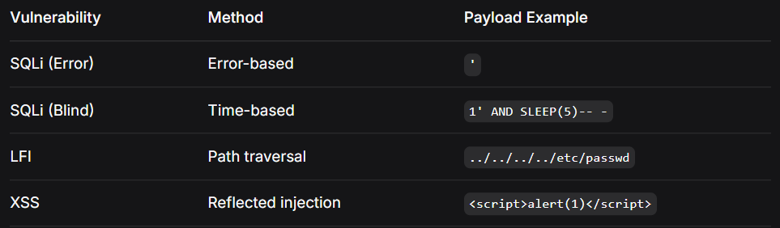

# Mini Web Vulnerability Scanner

[](https://www.python.org/downloads/)
[](LICENSE)
[]()

A comprehensive command-line web vulnerability scanner for detecting XSS, SQL Injection, and LFI vulnerabilities through automated form analysis.

## 🚀 Features

### Version 3 Enhancements
- **🐍 SQL Injection Detection**: Both error-based and time-based blind SQLi testing
- **📁 LFI (Local File Inclusion) Detection**: Tests for directory traversal vulnerabilities
- **⚡ Time-based Testing**: Implements sleep-based blind detection
- **🔍 Multi-vector Scanning**: Combined vulnerability detection in a single run

### Core Features
- **Form-based Vulnerability Testing**: Automatically detects and tests HTML forms
- **GET Parameter Scanning**: Tests URL parameters for multiple vulnerability types
- **Multi-method Support**: Handles both GET and POST form submissions
- **Automated Form Parsing**: Uses BeautifulSoup for HTML analysis
- **Error Pattern Detection**: Identifies SQL errors in responses

## 📋 Prerequisites

- Python 3.x
- Required libraries:
  - `requests`
  - `beautifulsoup4`

## 🔧 Installation

1. Clone the repository:
```bash
git clone https://github.com/yourusername/mini-web-scanner.git
cd mini-web-scanner
```

### Install dependencies:

```bash
pip install requests beautifulsoup4
```

## 💻 Usage
### Basic Usage
```bash
python webscan.py <target_url>
```

### Examples
```bash
# Scan a search page
python webscan.py https://example.com/search

# Scan a contact form
python webscan.py https://example.com/contact

# Scan any page with forms
python webscan.py https://example.com
```

### How It Works
Form Discovery: Parses HTML to find all forms and their inputs

SQL Injection Testing:

Error-based: Injects ' and checks for SQL error messages

Time-based: Uses SLEEP() commands to detect blind SQLi

LFI Testing: Attempts directory traversal using ../../etc/passwd

XSS Testing: Injects JavaScript payloads into form fields

Vulnerability Detection: Analyzes responses for indicators of compromise

### Output Example
```text
[!] SQLi in parameter 'id'
[!] LFI in parameter 'file'
[!] XSS in https://example.com/search (action=/search.php)
[!] SQLi in parameter 'username' (time-based)
```

### 🛡️ Vulnerability Testing
SQL Injection Tests
Error-based: Checks for common database error messages

SQL syntax, mysql_fetch, ORA-, Unclosed quotation mark

Time-based: Uses 1' AND SLEEP(5)-- - payload

Detects response delays > 4.5 seconds

LFI Tests
Directory Traversal: Tests ../../../../etc/passwd

File Inclusion: Checks for root: in response

XSS Tests
- <script>alert('XSS')</script> - JavaScript injection

-  - Image-based XSS

## 🔍 Technical Details
### Detection Methods



### Supported Error Patterns
SQL syntax errors

MySQL fetch errors

Oracle errors (ORA-)

Unclosed quotation marks

### ⚠️ Disclaimer
- This tool is for educational and authorized testing purposes only.

- Only use on websites you own or have explicit permission to test

- Unauthorized scanning may be illegal

- The developers assume no liability for misuse

- Always obtain written permission before scanning

- Time-based attacks may impact server performance

### 🔒 Security Best Practices
- Always obtain written permission before scanning

- Test in isolated environments when possible

- Use responsibly and ethically

- Document all testing activities

- Report vulnerabilities responsibly

- Avoid using time-based tests on production systems

### 🚧 Current Limitations
- Only tests form parameters (no URL parameter scanning for SQLi/LFI)

- Limited payload sets

- No WAF bypass techniques

- No crawling capabilities

- No authentication/session support

- Single-threaded scanning

- Limited error pattern database

- No report generation

### 📈 Future Enhancements
Version 4 Roadmap
□ Support for POST-based SQLi/LFI
□ Custom payload lists for all vulnerability types
□ Advanced evasion techniques
□ Multi-threaded scanning
□ DOM-based XSS detection
□ More comprehensive error pattern database
□ Database fingerprinting
□ Boolean-based blind SQLi detection
□ XXE (XML External Entity) detection


### Long-term Vision
□ Full crawling capabilities
□ Authentication support (cookies/sessions)
□ Report generation (HTML/JSON)
□ CI/CD pipeline integration
□ Docker container support
□ API endpoint scanning
□ Command injection detection
□ SSRF (Server-Side Request Forgery) detection


### 🤝 Contributing
Contributions are welcome! Please follow these steps:

Fork the repository

Create a feature branch (git checkout -b feature/AmazingFeature)

Commit your changes (git commit -m 'Add some AmazingFeature')

Push to the branch (git push origin feature/AmazingFeature)

Open a Pull Request


### Contribution Guidelines
- Follow PEP 8 style guide

- Add comments for complex logic

- Include error handling

- Update documentation accordingly

- Test on multiple platforms

### 🙏 Acknowledgments
BeautifulSoup - For HTML parsing capabilities

Requests - For HTTP handling

OWASP - For vulnerability testing guidelines

PortSwigger - For SQL injection methodology

The security community for payload suggestions

### 📚 Resources

[OWASP SQL Injection](https://owasp.org/www-community/attacks/SQL_Injection)

[OWASP XSS Prevention Cheat Sheet](https://cheatsheetseries.owasp.org/cheatsheets/Cross_Site_Scripting_Prevention_Cheat_Sheet.html)

[LFI Testing Guide](https://owasp.org/www-community/attacks/Path_Traversal)

## 📊 Version History
### v3.0 (Current)
- Added SQL Injection detection (error-based + time-based)

- Added LFI detection

- Enhanced vulnerability scanning scope

- Improved reporting format

### v2.0
- Added BeautifulSoup form detection

- Form-based XSS injection

- Support for both GET and POST methods

- Multiple input field testing

### v1.0
- Basic GET-based XSS detection

- Simple payload injection

- Command-line interface

### Made with ❤️ for the security community